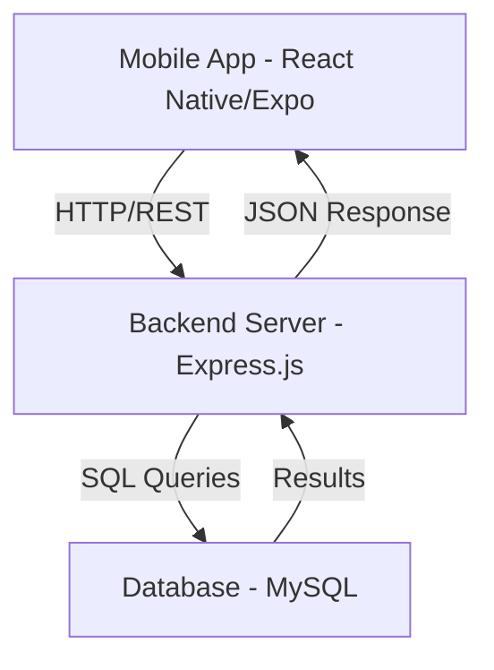

# AuraSocial - Professional Social Feed App

AuraSocial is a modern, high-performance social feed application built with **React Native (Expo)**, **Node.js**, and **MySQL**. It features a sleek, interactive user interface with a robust backend architecture, designed to provide a seamless social networking experience.

---

## 🏗️ Project Architecture

The application follows a **Decoupled Full-Stack Architecture**, ensuring scalability and maintainability.



### 1. Frontend (Mobile Client)
- **Framework**: React Native (managed via Expo)
- **Styling**: Component-based styling with `StyleSheet` and `LinearGradient` for a premium look.
- **Navigation**: Custom state-driven navigation for optimized performance.
- **Data Fetching**: Asynchronous API integration using the Fetch API.

### 2. Backend (REST API)
- **Environment**: Node.js
- **Framework**: Express.js
- **Middleware**: CORS (Cross-Origin Resource Sharing) and JSON parsing.
- **Endpoints**:
  - `GET /posts`: Fetches all social posts with real-time metadata.
  - `GET /posts/:id`: Retrieves detailed information for a specific post.

### 3. Database Layer
- **Engine**: MySQL
- **Schema**: Relational structure optimized for social data (users, posts, interactions).
- **Environment**: Compatible with XAMPP/Local MySQL environments.

---

## 🚀 Key Features

- **Dynamic Social Feed**: Real-time rendering of social posts from the database.
- **Detailed View**: Interactive post details with transition animations.
- **Premium UI**: Dark-themed aesthetic with gradient accents and high-quality typography.
- **Robust Error Handling**: Graceful handling of network states and database connections.

---

## 📂 Project Structure

```text
Task2/
├── App.js                 # Entry point & Main Navigation
├── app.json               # Expo configuration
├── package.json           # Frontend dependencies
├── screens/               # UI Screens
│   ├── SocialFeed.js      # Main Feed Component
│   └── PostDetails.js     # Individual Post View
├── backend/               # Server-side Logic
│   ├── server.js          # Express server entry point
│   ├── package.json       # Backend dependencies
│   └── setup_database.sql # MySQL Schema & Seed data
└── src/                   # Shared utilities (if any)
```

---

## 🛠️ Setup & Installation

### Prerequisites
- **Node.js** (v18+)
- **Expo Go** (on mobile) or **Android Studio/Xcode**
- **XAMPP** or a local MySQL server

### 1. Database Setup
1. Open your MySQL client (e.g., phpMyAdmin).
2. Run the SQL script located in `backend/setup_database.sql`.

### 2. Backend Setup
```bash
cd backend
npm install
node server.js
```

### 3. Frontend Setup
```bash
# From the root Task2 directory
npm install
npx expo start
```

---

## 📄 License
This project is licensed under the MIT License.

---

*Designed & Developed for Advanced Mobile Application Development.*
